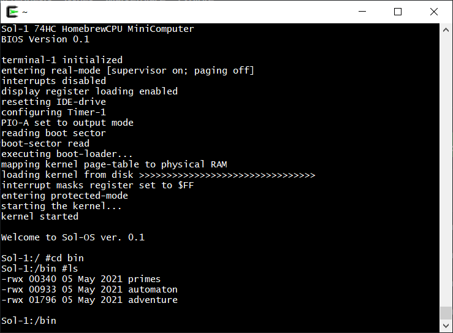
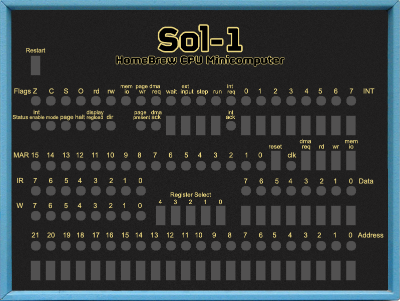
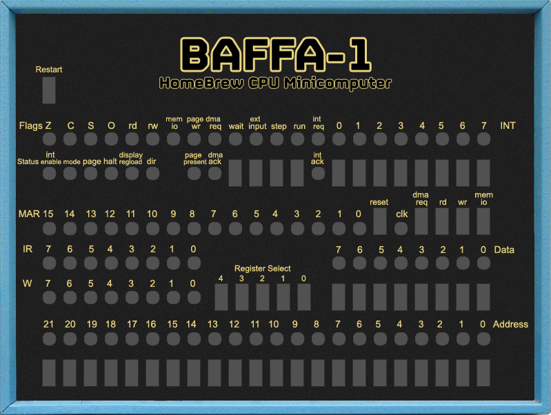

# Baffa-1 HomebrewCPU Minicomputer System Emulator 

This is an emulator for Baffa-1 HomebrewCPU Minicomputer - A complete CPU and Minicomputer built from scratch in 74LS logic. Baffa-1 is a clone of Sol-1 designed by Paulo de Tarco Constantino Junior using 74HC series (http://sol-1.org) and inspired by [Bill Buzbee's work](http://homebrewcpu.com) on the [Magic-1 Minicomputer](http://www.magic-1.org/)

The original computer softwares (bios, kernel, sample assembly language programs, ...) are available at https://github.com/abaffa/SOL1_MiniComputer.

The microcode editor is available at https://github.com/abaffa/baffa-1_mce.

The emulator software is available at https://github.com/abaffa/baffa-1_emulator.

-----BEGIN LICENSE NOTICE----- 

Baffa-1 HomebrewCPU Minicomputer System Emulator

Copyright (C) 2021  Augusto Baffa, (baffa-1.baffasoft.com.br)

This program is free software; you can redistribute it and/or
modify it under the terms of the GNU General Public License
as published by the Free Software Foundation; either version 2
of the License, or (at your option) any later version.

This program is distributed in the hope that it will be useful,
but WITHOUT ANY WARRANTY; without even the implied warranty of
MERCHANTABILITY or FITNESS FOR A PARTICULAR PURPOSE.  See the
GNU General Public License for more details.

You should have received a copy of the GNU General Public License
along with this program; if not, write to the Free Software
Foundation, Inc., 51 Franklin Street, Fifth Floor, Boston, MA  02110-1301, USA.

-----END LICENSE NOTICE----- 
